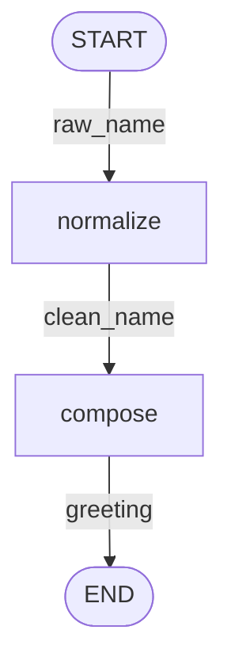
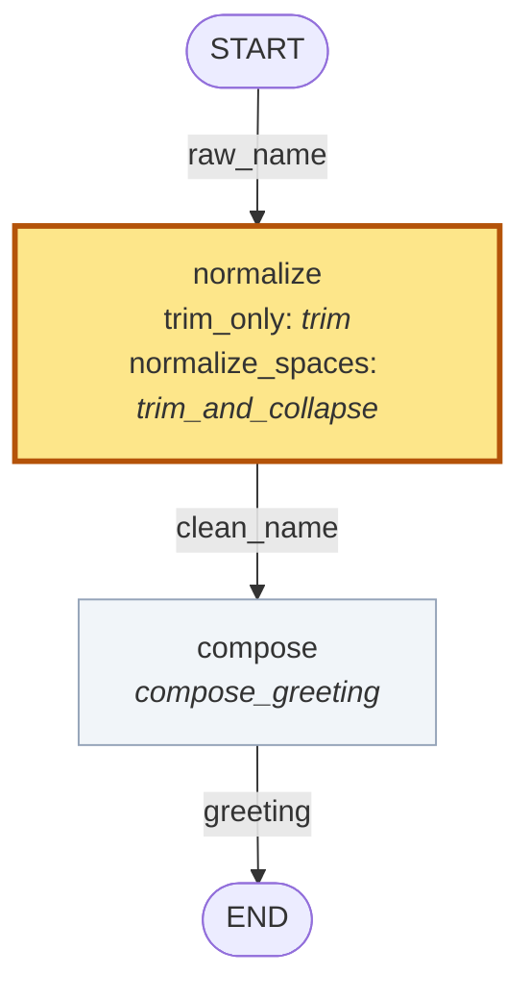

# workflow-workbench

*A declaration layer over Pydantic Graph Builder.*

**Let an AI coding agent build a workflow unsupervised and it produces code that works and is
[incoherent](docs/glossary.md#coherence).** Not broken — that you would notice. Incoherent: a fan-out whose results are
silently dropped, two wires crossed between values of the same type, a stage nobody implemented.
It runs, it returns something of the right shape, and nothing downstream can tell.

The second one is worth making concrete, because it is the one a type checker cannot help with.
The example below carries `raw_name` and `clean_name` — **both `str`**. Wire the raw one into the
step that composes the greeting and nothing complains: right type, right shape, and the
normalization stage silently stops mattering. Declaring each value by NAME, not just by type, is
what turns that into a finding.

Workflow Workbench is a [declaration layer](docs/glossary.md#declaration-layer) over Pydantic Graph Builder. You write the workflow's
shape and its data contracts as **data**, before any step exists — which is what makes that class
of defect findable:

```python
spec.coherence_check()      # 12 well-formedness rules, 7 of them with nothing implemented
spec.diagram()              # a picture of the same declaration
spec.render(strategy)       # refuses outright if anything blocks
```

So the agent gets an acceptance test it cannot talk its way past, and you get a drawing of the
design before you read a line of its code.

**What you do:** specify the workflow and its data contracts, inspect its diagram, then have the
agent implement the steps. Bind alternative implementations as strategies and compare them
through simple evaluation battles.

The declaration is also the part you can hold in your head, and it stays that way: **its size is
set by the shape of the workflow, not by the complexity of the steps.** A step body can grow to
500 lines; `StepSpec("price", inputs=(item,), outputs=(cost,))` stays one. Across the examples in
this repo the declaration runs 11 to 43 lines, whatever is bound into it.

Four problems, and the same declaration answers all four:

| | |
|---|---|
| **An agent's output works and is incoherent.** Each piece is locally fine; the whole does not add up. | `coherence_check()` — 12 [well-formedness rules](docs/glossary.md#well-formedness-rule), 7 needing nothing implemented |
| **A reasoning strategy cannot be asserted correct — only compared.** There is no right answer to diff against, so "better" is an empirical question. | [`eval_battle()`](docs/glossary.md#battle) — same cases, same evaluators, plus a replicate arm as the [noise floor](docs/glossary.md#noise-floor) |
| **Complexity grows unless pieces are reused.** Two arms that differ in one stage should say so, not be two files. | the [data language](docs/glossary.md#deep-embedding): declare a role once, bind it many ways; `SubgraphBinding` reuses a whole child design as one node |
| **You cannot see what you built.** | `diagram()` and `diff_diagram()`, from the declaration alone |

On that last one, honestly: Pydantic Graph **can** emit mermaid — `build_mermaid_graph` in
`graph_builder.py`. Two differences, not a long list. It takes a BUILT graph's internals, so every
implementation must exist first; ours reads the declaration, so the picture arrives before the
code. And ours can draw **two strategies at once**, greying what they share and highlighting what
differs, which is a question about a comparison rather than about a graph.

Pydantic Graph executes the workflow; Pydantic Evals evaluates its results.

### The thesis, in one line

**Making AI-agent development with an SWE agent interpretable.**

Longer: an opinionated declaration layer for work that is *subjective and hard to evaluate* —
mixing and matching algorithms so that quasi-language reasoning can be done safely, comparably,
debuggably, auditably. It makes two reasoning strategies **always** comparable — enforced, not
hoped for, since a battle takes one design and bindings are matched by identity — and makes the
difference attributable to a **named stage**, then draws it.

The division of labour that falls out of it is the part worth keeping:

| owns | | |
|---|---|---|
| **you** | the declaration | ~15 lines, readable in one sitting |
| **the agent** | the step bodies | however long they need to be |
| **`coherence_check()`** | the contract between them | an acceptance test it cannot talk its way past |

An agent can rewrite every step body and **cannot quietly change the shape**, because changing
the shape means editing the lines you read.

### ⛔ When not to use this

If your stages are deterministic and you would never swap one, you do not need this. Use
Pydantic Graph directly.

This earns its keep when a stage is a **judgement call** — when two competent people would
implement it differently, and you cannot assert which is right, only measure which does better.
A stage worth declaring is a stage worth arguing about.

Terms used precisely here — *coherence*, *well-formedness*, *stated gap*, *battle* — are defined
in the [glossary](docs/glossary.md), with where each word comes from and what it does **not** mean.

Built on [Pydantic Graph](https://ai.pydantic.dev/graph/) and
[Pydantic Evals](https://ai.pydantic.dev/evals/). Independent; not affiliated with Pydantic.

## What it looks like

This is **their** example, declared our way. Pydantic Graph's smallest complete builder program
is two steps where the second formats the first's output
([`visualize_graph.py`](https://pydantic.dev/docs/ai/graph/builder/)); the same shape runs here,
so the difference you are looking at is the declaration layer and nothing else:

| | step 1 | step 2 |
|---|---|---|
| **upstream**, unchanged — their [`visualize_graph.py`](https://pydantic.dev/docs/ai/graph/builder/) | `step_a` → `10` | `step_b` → `f'Result: {ctx.inputs}'` |
| **the control** — [`their_hello.py`](examples/ladder/their_hello.py): upstream's shape, a greeting instead of a number, and no workbench in the file | `pick` → `"Hello"` | `compose` → `f"{ctx.inputs}, {ctx.state.name}!"` |
| **ours** — [`greeting.py`](examples/greeting.py), the same workflow declared | `normalize` → a clean name | `compose` → `f"Hello, {name}!"` |

Theirs is fine, and that is the point of keeping it: one graph with one implementation per step
runs perfectly well like that. What it cannot do is check or draw itself before the steps are
written, or answer *"and what if `normalize` were written differently?"* — which is the only
thing the rest of this page is about.

One workflow — normalize a name, then compose a greeting from it:

| step | input | output |
|---|---|---|
| `normalize` | raw name, `str` | normalized name, `str` |
| `compose` | normalized name, `str` | greeting, `str` |

Desired behaviour: preserve the name's words, trim surrounding whitespace, collapse repeated
internal whitespace, return `Hello, {name}!`.

That table is the whole declaration, and it draws itself. **Nothing is implemented at this
point** — no `normalize` body, no `compose` body, no strategy, nothing an agent has written:



Bare boxes, because nothing is bound to them yet. This picture and `coherence_check()` are what
you review *before* asking an agent for a line of code — which is the one thing a drawing taken
from a built graph cannot do, since building it requires the code to already exist.

Two strategies disagree about how much of that `normalize` does. Same graph, two implementations
bound: `compose` is the same function in both, so the comparison greys it and highlights the one
node that varies:



Both satisfy the same declared types and structure, and every check passes for both. Only the
evaluation separates them:

| case | input | `trim_only` | `normalize_spaces` |
|---|---|---|---|
| `padded` | `"  Ada Lovelace  "` | `Hello, Ada Lovelace!` | `Hello, Ada Lovelace!` |
| `inner_run` | `"Ada   Lovelace"` | ✗ `Hello, Ada   Lovelace!` | `Hello, Ada Lovelace!` |
| `both` | `"  Grace   Hopper  "` | ✗ `Hello, Grace   Hopper!` | `Hello, Grace Hopper!` |
| `already_clean` | `"Alan Turing"` | `Hello, Alan Turing!` | `Hello, Alan Turing!` |
| | **exact-match score** | **0.50** | **1.00** |

A **battle** runs both strategies over the same cases with the same evaluators — here exact
matching against the expected greeting. `0.50` is two of four: a result on this four-case
demonstration dataset and nothing beyond it.

⚠️ **And you would never need this library for this.** Nothing in the greeting example is
contestable — `trim` versus `trim_and_collapse` is a question with a right answer you could look
up. It is here because the whole mechanism fits in sixty seconds at this size, not because it
earns its keep. [`examples/contestable.py`](examples/contestable.py) is the shape that does:
four stages that are each a judgement call, two strategies differing in one of them, and — since
a design is data — a diagram, a coherence check and a diff with **nothing implemented**.

`eval_battle` also scores one strategy against itself; that replicate is the noise floor a real
delta has to clear. It is `0.00` here because both implementations are deterministic — a `0.00`
floor on a model-backed arm usually means a cache answered the second run.

⚠️ **Taking that floor is currently YOUR job, and that is a real gap.** `eval_battle` labels a
replicate when you hand it the same strategy twice; it does not run one for you. So a battle can
report arm B ahead by 0.08 while the same arm scores ±0.125 against itself — which is not
hypothetical, it is a measured result from the first corpus this was used on, where one metric's
floor (6.0) was larger than its mean (5.0). **A delta inside the floor is not a result**, and
nothing yet stops you reporting one.

The whole example: [`examples/greeting.py`](examples/greeting.py).

## Quickstart

Python 3.12 or newer, and [uv](https://docs.astral.sh/uv/). No API keys: the example is pure
string handling and calls no model.

```bash
git clone https://github.com/borisdev/workflow-workbench
cd workflow-workbench
uv sync --no-dev --extra evals
uv run python3 -m examples.greeting
```

Everything it produces goes to the terminal; no files are written. Excerpt:

```
1. coherence_check() with nothing implemented: clean
...
3. what varies between the two strategies: {'normalize': ('trim', 'trim_and_collapse')}
...
   case           input                  trim_only                  normalize_spaces
   inner_run      'Ada   Lovelace'       'Hello, Ada   Lovelace!'   'Hello, Ada Lovelace!'
...
   noise floor (same strategy twice): {'ExactMatch': 0.0}
   trim_only        0.50
   normalize_spaces 1.00
```

Both mermaid blocks above go past on the way — the specification, then the comparison. A browser
viewer is available as a separate process — `uv run python3 -m workflow_workbench.cli serve`, see
[`serve.py`](workflow_workbench/serve.py) — and nothing in the quickstart needs it.

## The development sequence

| | step | what you can inspect |
|---|---|---|
| 1 | specify the workflow | the nodes, named values and edges, as data |
| 2 | check and draw it | `coherence_check()` findings and `diagram()` mermaid, with nothing implemented |
| 3 | implement the steps | ordinary Pydantic Graph step bodies |
| 4 | bind a named strategy | `diagram(strategy)` — the design with each role's implementation named |
| 5 | check the strategy | missing bindings, wrong return types, and `render()` refusing outright |
| 6 | execute and evaluate | outputs per case, scores, `varies()` and `diff_diagram()` |

Stages 2 and 5 are what a specification buys, and neither needs a second strategy: one
implementation per step still gets a drawing before it is written and a refusal when one is
missed.

## What `coherence_check()` enforces

<details>
<summary><strong>Every rule — generated from each check's own docstring</strong></summary>

<!-- rules:start -->
**12 rules.** `coherence_check()` returns one finding per violation and an empty list for a clean design; `render()` refuses on any finding that blocks.

**7 need no implementations at all** — runnable the moment `nodes` and `edges` are written.

| check | rule |
|---|---|
| `check_names` | Node names must be unique — `render()` uses them as graph node ids. |
| `check_reachable` | Every node reachable from START, and every node able to reach END. |
| `check_variables` | Per edge: the variable it carries must be an output of its source and an input of its target. |
| `check_step_arity` | A step body receives exactly ONE value, so a node cannot consume two inputs at once. |
| `check_decisions` | `when` appears exactly on the edges leaving a decision, and nowhere else. |
| `check_transform_edges` | A transform edge is fixed (`apply=`) or a variation point (bound) — exactly one. |
| `check_fan_out_rejoins` | Everything a fan-out produces must reach a join before it reaches END. |

**5 more once a strategy exists**, checking the implementations against the roles they fill.

| check | rule |
|---|---|
| `check_bindings` | The strategy binds exactly the declared VARIATION POINTS — no missing, no extra. |
| `check_implementations` | Each bound CALLABLE is callable and takes exactly one positional argument (`ctx`). |
| `check_subgraphs` | Every child design used as a node implementation fits the node it is bound to. |
| `check_variable_types` | Each implementation returns the type its role is declared to produce. |
| `check_recursion` | A design does not implement one of its own nodes with itself. |
<!-- rules:end -->

</details>

Every one of these exists because it caught something that otherwise **ran and returned a
plausible answer**. Each check's docstring in [`checks.py`](workflow_workbench/checks.py) carries
the measured case that produced it.

**These are structural checks, not a proof of correctness.** A step that returns its input
untouched satisfies every rule above and still does nothing — that is the boundary between what a
specification checks and what an evaluation measures, which is why `eval_battle` exists.

A finding is a `CoherenceFinding`: a `str` subclass, so it reads as the sentence it is, carrying
`check`, `about` and `blocking` so an agent can branch on structure rather than parse English. A
`NOT CHECKED — …` finding is a [**stated gap**](docs/glossary.md#stated-gap), not a pass, and does not block `render()`.


## The same example, in five stages

### 1. Declare the nodes, the named values, and the edges

```python
raw_name = VariableSpec("raw_name", str)
clean_name = VariableSpec("clean_name", str)
greeting = VariableSpec("greeting", str)

normalize = StepSpec("normalize", inputs=(raw_name,), outputs=(clean_name,))
compose = StepSpec("compose", inputs=(clean_name,), outputs=(greeting,))

class Greeting(GraphSpec):
    name = "greeting"
    input_type, output_type = str, str
    nodes = (normalize, compose)
    edges = (EdgeSpec(source=START, target=normalize, carries=raw_name),
             EdgeSpec(source=normalize, target=compose, carries=clean_name),
             EdgeSpec(source=compose, target=END, carries=greeting))
```

`clean_name` and `greeting` are both `str`, which is why they are separate variables: no type
checker can catch `compose` being wired to the wrong one when there is only one type in the room.
A name can. Edge fields are keyword-only and `carries` is required — four interchangeable-looking
slots are one transposition away from a graph that is wrong and runs.

#### The data language

<details>
<summary><strong>Every word you declare a design with — generated from the types' own docstrings</strong></summary>

<!-- language:start -->
A design is **data** — tuples of these, in a class body. Nothing executes, which is what lets `coherence_check()` and `diagram()` read it before a single step is written.

**Values** — What flows. Named, so a mis-wiring is visible when the types are identical.

| | |
|---|---|
| `VariableSpec` | A named, typed value that may flow along an edge. |

**Boxes** — Every box the design declares. Only a step takes an implementation.

| | |
|---|---|
| `StepSpec` | A semantic role with a typed contract. Deliberately implementation-free. |
| `JoinSpec` | The one thing that can combine several arrivals into one value. |
| `DecisionSpec` | A router. Sends the value down one branch, chosen by its TYPE. |
| `NodeSpec` | `StepSpec` \| `JoinSpec` \| `DecisionSpec` |

**Wires** — How values move. The kind of edge is the kind of movement.

| | |
|---|---|
| `EdgeSpec` | One wire: `source -> target`, carrying `carries`. |
| `MapEdgeSpec` | Fan out: `carries` is a collection, and the target runs ONCE PER `delivers`. |
| `TransformEdgeSpec` | A cheap SYNCHRONOUS reshape that happens ON THE WIRE, creating no node. |

**Endpoints** — The graph's own boundary, declared like anything else.

| | |
|---|---|
| `START` | The graph's entry. |
| `END` | The graph's exit. |

**The design, and what fills it** — One design, many competing sets of implementations.

| | |
|---|---|
| `GraphSpec` | Subclass it, declare `nodes` and `edges`. That is the whole interface. |
| `StrategySpec` | A complete Bindable -> implementation mapping. One competitor. |
| `SubgraphBinding` | A whole child design — `GraphSpec` + `StrategySpec` — used as ONE node's implementation. |
| `Bindable` | `StepSpec` \| `TransformEdgeSpec` |

The two unions are annotations, not classes you instantiate — calling either one raises `TypeError`. They exist so a signature can say *any declared box*, or *anything a strategy must bind*, and have it type-check.
<!-- language:end -->

</details>

### 2. Check it and draw it, before implementing anything

```python
spec = Greeting()
spec.coherence_check()      # -> [] — no strategy, no implementations, no engine
spec.diagram()    # -> mermaid for the specification
```

This is the stage a built `Graph` cannot reach: a `Graph` needs every function to exist first.

### ⛔ A strategy is an ALGORITHM, not an environment

The single most likely way to misuse this. **Fake services versus production services are not two
strategies.** Infrastructure goes in `ctx.deps`, where Pydantic Graph already puts it.

```
deps        a fake search client vs the real one; a stub model vs a live one; a file vs a service
strategy    one call vs two; extract-then-verify vs extract-only; a wide search vs a narrow one
```

The test is whether the two arms **deserve to be evaluated on the same cases**. Two
implementations of one algorithm do. A fake and a real client do not — the fake exists so the
real one's cost is not paid in a test, and "the fake scored worse" is not a finding about
anything.

Bind an environment as a strategy and the battle reports a difference that is real, meaningless,
and indistinguishable from the one you were looking for.

### 3. Implement the steps, then bind them as named strategies

The step bodies are ordinary Pydantic Graph steps — nothing in them refers to this library:

```python
async def trim(ctx) -> str:
    return ctx.inputs.strip()

async def trim_and_collapse(ctx) -> str:
    return " ".join(ctx.inputs.split())

async def compose_greeting(ctx) -> str:
    return f"Hello, {ctx.inputs}!"

trim_only = StrategySpec("trim_only", {normalize: trim, compose: compose_greeting})
normalize_spaces = StrategySpec("normalize_spaces",
                                {normalize: trim_and_collapse, compose: compose_greeting})
```

### 4. An incomplete strategy is refused at declaration time

A strategy binds **every** node, including ones it does not change. Leave one out and the check
says so; `render()` refuses rather than building a graph with a hole in it:

```python
unfinished = StrategySpec("unfinished", {normalize: trim_and_collapse})
spec.coherence_check(unfinished)
# ["strategy 'unfinished' does not bind node 'compose'. Every one is bound explicitly,
#   including unchanged ones — a partial strategy makes 'what varies between these arms'
#   unanswerable without reading both files."]
spec.render(unfinished)   # raises SpecError with the same finding
```

A finding is a sentence, and it is also **structured**. `CoherenceFinding` is a `str` subclass, so
everything above reads exactly as it looks — and an agent driving this as its acceptance test can
branch on fields instead of matching on prose:

```python
f = spec.coherence_check(unfinished)[0]
f.check       # 'check_bindings'  — which check produced it
f.about       # 'compose'         — the node; 'source->target' for an edge; '' for the design
f.blocking    # True              — False only for a `NOT CHECKED — …` stated gap

from workflow_workbench import blocking
blocking(spec.coherence_check(unfinished))    # what `render()` refuses on, gaps excluded
```

`blocking` is a bool rather than a severity enum because there are two states and no third has
turned up. A stated gap and a clean pass must never read the same — that is the one distinction
`coherence_check()` has always made, and it used to be recoverable only with `startswith("NOT CHECKED")`.

Which is what makes growing a workflow safe: add a node and every existing strategy fails loudly
rather than skipping a step it never heard of
([`stage3_new_node.py`](examples/ladder/stage3_new_node.py)).

### 5. Construct the graphs and evaluate both strategies

`spec.diagram()` draws the specification; `spec.render(strategy)` constructs a real
`pydantic_graph.Graph` — their object, their executor, their `iter()`:

```python
graph = spec.render(normalize_spaces)
graph.run_sync(inputs="  Ada   Lovelace  ")      # 'Hello, Ada Lovelace!'

floor = eval_battle(spec, trim_only, trim_only, dataset())          # the noise floor
battle = eval_battle(spec, trim_only, normalize_spaces, dataset())  # the comparison
```

`eval_battle` takes one `spec` and two strategies, so both arms render from the same nodes, edges
and types. There is nowhere to put a second design.

## When does a stage become a nested graph?

A step can be implemented by a whole child design rather than a function. The useful question is
when to do that, and the tempting answer is wrong.

**The tempting answer:** *"if you cannot say what a good implementation looks like, it is not a
step — it is a sub-design."* That reads well and it conflates two different situations:

| can you state the objective? | can you settle it by reading the code? | |
|---|---|---|
| **no** | — | **not ready to be anything.** Go write the objective. |
| yes | yes | **a step.** A function; review is the oracle. |
| yes | **no** | **a sub-design.** Give it a boundary and battle it. |

The slogan merges rows 1 and 3 — and row 1 is the dangerous one, because a boundary plus an
evaluation over an *unstated* objective still produces a number, and a number reads as signal.
Decomposition cannot repair an objective nobody wrote down.

**`StepSpec.problem` is how you leave row 1.** Non-empty means somebody stated what this stage is
for. Empty means nobody wrote one — never that the stage is easy.

**The test that actually decides it:** does this stage have ONE failure mode or two? Anything
that retrieves and then chooses has two — missing a candidate is a *recall* failure, picking the
wrong one from a good set is a *precision* failure, and they have different causes and different
fixes. One score over both averages them and points you at the wrong half. Two boundaries, two
scores, and the second score only exists because the boundary does.

### ⛔ There is no "LLM node" type, deliberately

The obvious request is a node subtype that forces richer fields — a problem, a rubric, its own
evaluation — for stages backed by a model. It is the wrong mechanism for three reasons:

- **It declares the answer to the question a battle asks.** The whole point is that one role takes
  an LLM arm *and* a deterministic arm. Type the role as an LLM node and the deterministic arm is
  illegal by construction.
- **Whether a stage calls a model is a fact about the implementation**, not about the role. It
  belongs to the strategy, which is where it already is.
- **Forcing prose destroys the signal it was added for.** A required brief means every node has a
  sentence, and the ones written to satisfy a type checker are indistinguishable from the ones
  written because somebody thought.

**Richness follows the boundary, not the node type.** A stage that deserves a problem, a rubric
and its own evaluation is a sub-design — and a graph already has all three, because a graph has a
declared public boundary you can build a dataset against. That is the one thing a `StepSpec` does
not have.

## Working with a coding agent

The specification is the reviewable artifact. Review the diagram and the contracts, and the
agent's job narrows to step bodies satisfying a declared input and output type for a named role,
with `coherence_check()` as the acceptance test.

A proposed change to the workflow itself is then a diff to `nodes` and `edges` — one small place,
reviewed on its own, not a behaviour change buried in a function body.

## What this does not do

### Structural checks are not a correctness proof

The specification supplies the structure and the data contracts; a strategy supplies
implementations; `render()` constructs the graph from those declarations. There is no second,
separately maintained wiring definition to drift from them — `edges` is the only way a graph gets
wired, with no hook and no override, so a strategy can change what a node *does* and cannot change
what the workflow *is*.

Every rule is in the generated table above, and the failure each one exists for is in that
check's docstring in [`checks.py`](workflow_workbench/checks.py) — one place, which is the point.
This section used to repeat all of them in a hand-written table and had already drifted to 10 of
12; a test now refuses a second table of check names anywhere outside the generated block.

⚠️ **The uncomfortable case, and it is from this repo's own review history.** Across five rounds of
review on one change, **every single finding was a check that was narrower than its claim** — not
code that was wrong. The dead-link test skipped malformed links. The table that said "every rule"
listed 10 of 12. The retired-API lint had no token for the method that release removed. The
compatibility oracle enumerated five string operations and omitted the three that broke. A UI
test drove one of three render surfaces.

The code was mostly right. **The things asserting it was right were the defects.** For a library
whose product is checks, that is the failure mode to expect in your own use of it: a check that
looks authoritative because it is specific, and is specific about the wrong thing.

All of that is **structural**. None of it says the workflow produces good answers: `trim_only`
passes every one of those and gets half the cases wrong. Structural consistency is what a
specification guarantees; behaviour is what the battle is for.

### What cannot be declared

- **The `BaseNode` authoring style cannot be declared.** It returns its own successor, so
  declared `edges` would be a claim it is free to ignore. Everything a `BaseNode` is used *for* —
  stop early, go back, dispatch — is declarable
  ([`stage10_no_basenode.py`](examples/ladder/stage10_no_basenode.py)).
- **Predicate branches are refused**, not missing: a callable in the specification cannot be drawn
  and two cannot be compared. Return a discriminating type from a step instead.
- **`map` and `transform` do not compose on one edge**, and `join` does not expose fork selection.
- For any of these, take the `Graph` that `render()` returns and use their API directly.

Row by row, with their code beside ours: [`docs/parity.md`](docs/parity.md).

## An example teaches the mechanism. A pattern has been battled.

The ambition is that reusable designs accumulate — the library supplies the grammar, you grow the
vocabulary. The hazard is that "pattern" becomes whatever somebody wrote six paragraphs about, so
the bar here is checkable rather than literary. A **pattern** is a reusable design that:

1. is importable by name — a graph plus its strategy, not a script that runs top to bottom;
2. ships a `Dataset` and at least two strategies, so `eval_battle` runs on it;
3. **has its noise floor recorded.**

(3) is the one that bites. A pattern claiming an arrangement helps, with no floor behind the
claim, is the same mistake as reporting a 0.08 delta against a 0.125 floor — with a grander name
on it.

⛔ **By that bar this repo has zero patterns today, and that is the honest state.** `greeting.py`
has a battle and says outright it is not contestable. `contestable.py` has a test forbidding it
from printing a score. There is no registry and no `Pattern` type, because there is nothing to put
in one yet — the definition is written down so the first real one has a bar to clear.

### ⚠️ Two names we expect to change

Proposals, not decisions — they are tracked, not quietly pending:

- **`SubgraphBinding`.** In graph theory a *subgraph* is a subset of a graph's own vertices and
  edges. A child design is not that: it is a separate graph whose result substitutes for one node.
  "Nested graph" is accurate; "subgraph" is a borrowed word bent to fit.
- **`blocking` as a bool.** Two states and no third had been observed when it was chosen. A third
  has since been observed — near-duplicate *names* are mechanically detectable and are a smell
  rather than a provable defect, so they do not belong among findings where every one is a defect.
  The likely answer is a separate check with its own exit code, not a widened enum.

## More

| | |
|---|---|
| [`docs/ladder.md`](docs/ladder.md) | eleven rungs, each adding one capability — subgraphs, joins, decisions, fan-out |
| [`docs/design.md`](docs/design.md) | why the pieces are shaped this way, and what this library does not own |
| [`docs/parity.md`](docs/parity.md) | every Pydantic Graph builder feature, declarable or not |
| [`docs/how-it-runs.md`](docs/how-it-runs.md) | their executor from the source, with a probe behind every claim |
| [`examples/greeting.py`](examples/greeting.py) | the walkthrough above; beside it a counter, a fan-out, subgraphs, extraction |
| [`examples/ladder/their_hello.py`](examples/ladder/their_hello.py) | the control — their smallest program's SHAPE, adapted to a greeting, with no workbench in the file |
| [`examples/contestable.py`](examples/contestable.py) | four judgement-call stages, two strategies, nothing implemented and no score |

Downstream of community requests for
[reusable/extensible nodes](https://github.com/pydantic/pydantic-ai/issues/798) and
[reusable subgraphs](https://github.com/pydantic/pydantic-ai/issues/3901) — complementary to
native Pydantic Graph, not a proposal to change it.

## Where this is going

Stated because the gap between what is built and what is intended should be readable, not
inferred. Tracked as issues, not promised here.

| | |
|---|---|
| **a flagship example that earns the library** | one graph IR in, competing reports out — four stages that are each a judgement call, two strategies differing in one. `contestable.py` is a placeholder for this shape with the nouns marked as stand-ins. |
| **`eval_battle` takes its own noise floor** | so a delta inside the floor cannot be reported as a result |
| **a problem brief on `GraphSpec`, not only on `StepSpec`** | a reusable design has its own problem, separate from the role it happens to fill |
| **the nested-graph rename** | see the naming note above |

Not planned: a rubric field on a node, an advisory severity, or a node subtype for model-backed
stages. Each was asked for and each is answered above by a boundary instead of a field.

## Licence

MIT — see [LICENSE](LICENSE).

## Verify it rather than believe it

```bash
uv run pytest -q
uv run python3 -m examples.greeting                 # the walkthrough above
uv run python3 docs/probe_api.py                    # the node-identity claims, against the real library
uv run python3 docs/probe_builder_features.py       # what the specification can and cannot express
uv run python3 docs/probe_executor.py               # every claim in docs/how-it-runs.md
uv run python3 -m workflow_workbench.parity --check  # docs/parity.md is generated, not written
```
